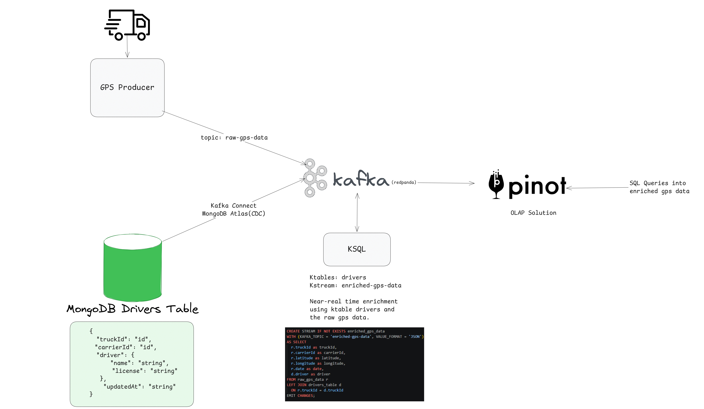

# 🚛 TrackGo - GPS Truck Simulator
TrackGo is a real-time fleet tracking system simulation built to demonstrate the power of Stream Processing and Real-Time Analytics.

The project uses a modern EDA stack to ingest, enrich, and analyze GPS data from moving trucks as it happens, rather than processing it in batches.

> The project was implemented based in a Brazillian book "Arquitetura Orientada a Eventos - Soluções escaláveis e em tempo real com EDA" from Robert Picanço

## 🏗️ Architecture Overview
The data flow:
- **Ingestion**: A simulator generates GPS coordinates and publishes them to a Redpanda (a lightweight Kafka alternative) topic called raw-gps-data.
- **Context (CDC)**: Metadata about trucks and drivers (names, license, etc.) is stored in MongoDB. We use Kafka Connect with Change Data Capture (CDC) to stream this information into a Kafka KTable.
- **Processing**: I've used KSQL to perform a real-time JOIN between the live GPS stream and the Driver KTable. This creates a new, enriched stream containing the full context of every "ping."
- **Analytics**: The enriched data is pushed to Apache Pinot, allowing for ultra-low latency analytical queries.



## 🛠️ Tech Stack
- Redpanda: A fast, C++ based Kafka-compatible event store.
- MongoDB: The source of truth for relational-style entity data.
- Kafka Connect: To bridge the gap between the database and the stream.
- KSQL: For SQL-like stream processing and data enrichment.
- Apache Pinot: A distributed OLAP datastore designed for real-time insights.
- Docker & Docker Compose: For easy environment orchestration.

## 🚀 Quick Start
You only need Docker installed to get this entire pipeline running.

Clone the repository:
```Bash
git clone https://github.com/your-username/trackgo.git
cd trackgo
docker-compose up -d
```

Wait for the magic: Give it a few minutes to spin up the containers and initialize the connectors. Once ready, the simulator will start pumping data into the system.